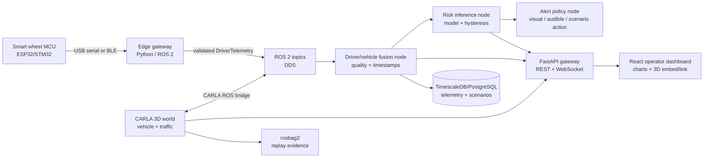

# Smart Steering Wheel Digital Twin: Assessment and Implementation Proposal

**Prepared:** 31 July 2026  
**Status:** Architecture and implementation report  
**Scope:** A working 3D vehicle simulation integrated with a sensorized smart steering wheel, driver-health analytics, and the existing dashboard.

## 1. Executive decision

Build the first working twin with **CARLA + ROS 2 + FastAPI + React**.  CARLA is the better primary 3D simulator for this project because the target is a road vehicle in a realistic traffic environment, not only a steering-wheel mechanism.  ROS 2 provides a clean, hardware-neutral event backbone, while the existing FastAPI and React code remain valuable as the operator dashboard and API gateway.

Use **Gazebo Sim** as a smaller, optional second simulator for steering-column mechanics, steering angle calibration, and hardware-in-the-loop (HIL) testing. Do not use it as the main driving visualisation.  Unity/Unreal may be added later for a polished demonstrator, but should not be the first integration because it duplicates CARLA's vehicle, traffic, and sensor capabilities.

The digital twin is feasible in a VM, provided it has accelerated 3D graphics. A GPU-less VM is sufficient for ROS, FastAPI, databases, and headless automated scenarios, but not for a convincing interactive CARLA display.

## 2. What exists today

| Area | Current implementation | Assessment |
| --- | --- | --- |
| UI | React/Vite dashboard with a WebSocket hook and health/vital components | Good foundation; currently not connected consistently through routing/app composition. |
| API | FastAPI REST status endpoint and a `/ws` stream | Good prototype boundary; needs a versioned canonical telemetry contract. |
| Telemetry | CSV replay of HR, HRV, GSR, skin temperature and a fixed grip-pressure value | Demonstrates replay only; it is not live hardware ingestion and has no steering/vehicle state. |
| ML | Random Forest risk classifier plus three-sample stabilisation | Viable research prototype; must use the exact trained feature order and be clinically validated before any safety claim. |
| Validation | A simple inference benchmark script | Useful start, but not an end-to-end twin test. |

### Findings that must be resolved before integration

1. `AIML/Week2/PythonCodeFiles/preprocess_data.py` has unresolved Git conflict markers, so project-wide Python compilation fails.
2. `AIML/Week3/model_evaluation_report.md` also has unresolved conflict markers.
3. Model training uses `[hr_mean, hr_std, gsr_mean, temp_mean]`; live API inference currently sends `[heart_rate, gsr, grip_pressure, skin_temperature]`. This is an invalid feature mapping and can make predictions unreliable.
4. The REST endpoint performs risk inference but the WebSocket path sends only raw replay data. The dashboard will therefore not receive predictions in normal real-time use.
5. `grip_pressure` is a constant (`4.0`), no sensor timestamp/quality/sequence number exists, and the stream is one shared CSV cursor for every client.
6. Python cache files and a local virtual environment are tracked/modified. They should be removed from source control with `.gitignore` in a separately approved cleanup task.

These are software-quality issues, not a reason to delay the simulator design. They should be closed in the first implementation sprint.

## 3. Twin definition and boundaries

This twin should represent three connected things:

1. **Physical steering wheel:** wheel angle, angular velocity, grip pressure, capacitive hand presence, GSR/EDA, skin temperature, PPG/ECG-derived heart rate, device state, and sensor quality.
2. **Driver state:** a time-aligned estimate of normal / warning / critical state, confidence, alert state, and model version.
3. **Vehicle and scene:** ego-vehicle pose, speed, steering, lane position, traffic, weather, collision/lane-invasion events, and optional camera/LiDAR/GNSS/IMU.

The twin is a research/training and system-test tool. It must **not** directly take control of a road vehicle or be represented as medical diagnosis. Any physical intervention requires a separate certified safety architecture, hazard analysis, and human-factors validation.

## 4. Target architecture



### Runtime responsibilities

| Component | Technology | Responsibility |
| --- | --- | --- |
| Wheel firmware | ESP32 or STM32, PlatformIO, FreeRTOS | Sample sensors; apply calibration; publish a timestamped packet; accept only non-safety-critical feedback commands. |
| Edge gateway | Python `pyserial`/BLE + ROS 2 `rclpy` | Decode packets, check ranges/CRC/staleness, use a monotonic clock, and publish a single canonical message. |
| Simulation | CARLA with its ROS 2 bridge | Render road/traffic, apply steering/throttle/brake, emit simulated vehicle state and events. |
| Integration | ROS 2 nodes, launch files, rosbag2 | Time synchronization, repeatable launches, recording and replay. |
| Intelligence | scikit-learn initially; ONNX Runtime later if needed | Feature extraction, model inference, confidence/quality handling, hysteresis, and scenario policy. |
| Product API | FastAPI | Authenticated dashboard-facing API only; translate ROS messages into WebSocket events. |
| Storage | PostgreSQL + TimescaleDB extension | Persistent telemetry, alerts, calibration revisions, scenario runs, and model metadata. |
| Dashboard | Existing React/Vite; Plotly/Recharts already installed | Live metrics, alert timeline, sensor health, scenario controls, and recording/replay selection. |
| Operations | Docker Compose for MVP; GitHub Actions | Reproducible deployment, testing, and separation of simulator, API, UI, and database. |

## 5. Canonical data contract

Define this before implementing nodes.  Do not pass unversioned dictionaries across system boundaries.

```text
DriverTelemetry v1
  event_time_ns, received_time_ns, sequence, source_id, schema_version
  wheel_angle_deg, wheel_rate_deg_s, grip_left_n, grip_right_n, hand_present
  heart_rate_bpm, hrv_ms, gsr_us, skin_temperature_c
  battery_pct, sensor_quality{ppg, gsr, temp, angle}, connection_state

VehicleTelemetry v1
  event_time_ns, scenario_id, simulation_time_s
  speed_mps, steering_normalized, throttle, brake, pose, lane_offset_m
  collision, lane_invasion, weather, autonomy_mode

DriverRisk v1
  event_time_ns, model_name, model_version, feature_schema_version
  raw_class, stabilized_class, confidence, data_quality, reason_codes

AlertEvent v1
  event_time_ns, severity, rule_id, acknowledgement_state, scenario_action
```

Create corresponding ROS 2 messages in `smart_wheel_msgs`, and Pydantic models in the API. Add JSON Schema/OpenAPI examples and contract tests so all consumers agree on units and names.

## 6. Recommended simulations

| Simulation | How it works | Value | Acceptance result |
| --- | --- | --- | --- |
| Live steering | Real wheel angle drives CARLA ego steering at 30–60 Hz; keyboard/virtual pedal drives speed initially | Demonstrates physical-to-3D coupling | Visible wheel rotation changes lane trajectory with logged latency. |
| Physiological replay | Existing CSV is converted to `DriverTelemetry` and replayed in simulation time | Fastest way to use current data | Dashboard and CARLA session display matching risk timeline. |
| Sensor fault injection | Disconnect, stale timestamp, noisy GSR, impossible temperature, stuck grip | Tests safety of data pipeline | System marks data degraded and suppresses unsupported risk decision. |
| Driver-risk scenario | Normal → warning → critical replay with controlled traffic/weather | Tests whole alert chain | Three-sample hysteresis produces one expected alert/event record. |
| Vehicle-event correlation | Lane departure/collision generated by CARLA while health state changes | Research basis for policy design | Scenario has deterministic rosbag, DB records, and test assertions. |
| HIL calibration | Real wheel firmware sends packets to simulator; optionally a force-feedback actuator remains isolated | Validates true device I/O | Packet loss, end-to-end latency, and calibration error meet defined targets. |

Use CARLA synchronous mode for automated tests so sensor, vehicle, and health replay use one deterministic simulation clock. Its ROS bridge exposes bidirectional ROS integration, vehicle controls, state, sensor data, collision and lane-invasion events. [CARLA ROS bridge documentation](https://carla.readthedocs.io/projects/ros-bridge/en/latest/)

## 7. VM and machine plan

### Development VM (recommended)

- **Guest OS:** Ubuntu 24.04 LTS.
- **Middleware:** ROS 2 Jazzy + Gazebo Harmonic for the mechanical mini-twin. ROS 2 Jazzy supports Ubuntu 24.04 x86_64/ARM64, and Gazebo recommends Harmonic with Jazzy on Ubuntu 24.04. [ROS installation support](https://docs.ros.org/en/jazzy/Installation/Alternatives/Ubuntu-Install-Binary.html) [Gazebo compatibility guidance](https://gazebosim.org/docs/harmonic/getstarted/)
- **VM host/hypervisor:** Linux host with KVM/QEMU + VFIO GPU passthrough is the reliable choice for interactive CARLA. VMware/VirtualBox virtual GPUs are acceptable only for light Gazebo/RViz use; benchmark before committing.
- **Resources:** 8 vCPU, 32 GB RAM, 100 GB SSD, and an NVIDIA GPU with 8 GB+ VRAM passed through for interactive CARLA. Allocate 4 vCPU/16 GB RAM for a headless CI worker.
- **Network:** host-only or bridged network for physical MCU; do not expose ROS DDS directly to public networks. Use a VPN or ROS bridge/API boundary for remote access.

### Deployment shape

| Environment | Runs | Notes |
| --- | --- | --- |
| Laptop/desktop | Firmware tools, React UI, FastAPI, optional local simulator | Best for developer feedback. |
| GPU VM/workstation | CARLA, ROS 2, rosbag recording, scenario tests | Interactive 3D twin. |
| Headless VM/CI | CARLA off-screen, ROS tests, FastAPI, database | Regression scenarios and nightly replay. |
| Wheel edge computer | MCU plus gateway only | Must continue basic sensor acquisition if cloud/VM is unavailable. |

Docker Compose should run the API, UI, DB, and ROS gateway. Keep the first CARLA installation native inside the Ubuntu GPU VM; containerize it only after GPU and display/network behaviour are proven.

## 8. Repository structure to add

```text
digital-twin/
  ros_ws/src/
    smart_wheel_msgs/          # .msg/.srv definitions
    smart_wheel_gateway/       # serial/BLE -> ROS
    driver_state_fusion/       # time and quality checks
    risk_inference/            # model and feature schema
    carla_smart_wheel_bridge/  # CARLA command/state adaptation
    twin_scenarios/            # launch files and deterministic tests
  config/
    telemetry_v1.json
    sensor_calibration.example.yaml
    scenario_profiles/
  docker/
  docs/
backend/
  app/                         # API adapter; no direct hardware logic
Frontend/                      # operator UI
firmware/                      # ESP32/STM32 source and packet specification
infra/                         # Compose, VM provisioning, CI
tests/                         # contract, replay, end-to-end tests
```

## 9. Phased delivery plan

| Phase | Deliverable | Exit criteria |
| --- | --- | --- |
| 0 — Stabilise (1 week) | Resolve conflicts, canonical feature schema, reproducible Python environment, API/WS contract | Full compile/test passes; REST and WebSocket emit identical prediction payload. |
| 1 — Data backbone (1–2 weeks) | `DriverTelemetry` messages, serial/BLE simulator, ROS gateway, rosbag recording | CSV and simulated MCU packets appear in ROS, FastAPI, React and a recorded bag. |
| 2 — 3D MVP (2 weeks) | CARLA ego vehicle, ROS bridge, wheel-angle-to-steering node, UI vehicle status | Real or emulated wheel moves CARLA vehicle; 10 repeatable scenarios run. |
| 3 — Driver twin (2 weeks) | Risk node, data-quality logic, alert policy, DB persistence and replay UI | Alert path is deterministic and verifiable with health scenarios. |
| 4 — HIL + assurance (2–3 weeks) | Real hardware, calibration workflow, fault injection, latency report, operating guide | Measured targets are met and safety limits are documented. |

## 10. Quality gates and measurable targets

- Wheel telemetry: 30 Hz minimum; wheel-control path p95 under 100 ms for the demonstrator.
- Dashboard: end-to-end telemetry p95 under 500 ms on the local network.
- Time: every event contains monotonic source and receive timestamps; reject stale/out-of-order data explicitly.
- Reliability: reconnect with no process restart; maintain a connection-state event.
- Reproducibility: each scenario stores map, weather, CARLA version, code commit, model version, calibration revision and random seed.
- Tests: unit tests for feature ordering and packet decoder; schema-contract tests; rosbag replay test; synchronous CARLA end-to-end test.
- Governance: consent/anonymisation rules for physiological data; do not train or evaluate only on synthetic labels when presenting claims of health performance.

## 11. Risks and mitigations

| Risk | Mitigation |
| --- | --- |
| 3D VM performs poorly | Start with headless CARLA test, then benchmark the intended GPU-passthrough VM before asset work. |
| ML output is misleading | Enforce model feature schema; show data quality and confidence; use it only as a research alert; collect labelled data for validation. |
| Sensor noise/poor skin contact | Calibrate per device/user, publish quality metrics, and fail safe to `UNKNOWN` rather than inventing a risk class. |
| ROS/FastAPI duplicate state | ROS is the operational source of truth; FastAPI is a read/control gateway only. |
| Non-deterministic demos | Record/replay rosbags and use CARLA synchronous scenario seeds. |
| Scope expands into autonomous driving/medical device | Separate research demonstrator requirements from regulated-product requirements and retain human acknowledgement. |

## 12. Suggested report package for review meetings

1. **This architecture report** — scope, recommendation, target state and deployment.
2. **System requirements specification** — actors, hardware, functional/non-functional requirements and constraints.
3. **Interface control document** — packet format, ROS messages, REST/WebSocket schemas, units, QoS and errors.
4. **Simulation verification report** — scenarios, scripts, recorded runs, expected/actual metrics and defect log.
5. **HIL calibration and latency report** — wheel calibration, sampling rate, loss, jitter and end-to-end measurements.
6. **Safety and data-governance note** — operational design domain, limits, hazards, privacy/consent and human override.
7. **Operations guide** — VM build, start/stop, recording/replay, recovery and troubleshooting.

## 13. Immediate next actions

1. Approve CARLA + ROS 2 as the MVP baseline and identify the wheel MCU and available GPU/host.
2. Fix the Git conflicts and the ML feature mismatch before connecting any live device.
3. Create the message package and a CSV-to-ROS replay node; this lets the current dataset drive the proposed twin without waiting for hardware.
4. Provision the Ubuntu GPU VM and prove one CARLA + ROS ego-vehicle launch.
5. Connect the physical/emulated steering angle, then add physiological telemetry and alert scenarios.

## Sources consulted

- [CARLA ROS bridge](https://carla.readthedocs.io/projects/ros-bridge/en/latest/) — two-way ROS integration, vehicle control, traffic events and sensors.
- [CARLA ROS bridge control topics](https://carla.readthedocs.io/projects/ros-bridge/en/latest/run_ros/) — ego vehicle control and status interfaces.
- [ROS 2 Jazzy Ubuntu installation](https://docs.ros.org/en/jazzy/Installation/Alternatives/Ubuntu-Install-Binary.html) — supported Ubuntu platform guidance.
- [Gazebo ROS 2 integration](https://gazebosim.org/docs/harmonic/ros2_integration/) — ROS/Gazebo bridge architecture and message bridging.
