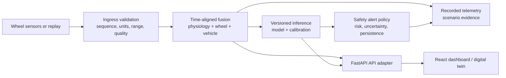

# Smart Steering Wheel Driver-Safety Platform — Industry-Grade Project Report

**Document status:** Technical design baseline / prototype readiness assessment  
**Scope:** Research and simulator demonstrator; not a medical device and not a vehicle-control system  
**Source of truth:** This repository and the evidence register in `docs/paper/PROJECT_EVIDENCE.md`

## Executive summary

The project has a credible prototype base: a FastAPI backend, React dashboard, synthetic telemetry generators, a risk-inference component, a versioned starting data contract, and a live browser digital twin. The next product-quality milestone is not adding more sensors; it is establishing a consistent, versioned telemetry-to-model pipeline with quality control, traceability, safe alert behaviour, and reproducible tests.

The recommended product position is **driver-safety decision support**. It may surface a risk/quality state to the driver or fleet/simulator operator. It must not diagnose a physiological disorder, claim clinical accuracy, take vehicle control, or rely on an unsupported prediction during data loss.

## Product outcome

Deliver a locally deployable demonstrator that can ingest replayed or emulated wheel telemetry, combine it with simulated vehicle context, render a live dashboard/digital twin, create time-stamped risk events, and safely return `UNKNOWN` when data are inadequate. Future field work may extend it into personalised fatigue/impairment-risk research after protocol approval and validation.

## Architecture baseline

**Operational ownership:** the telemetry/fusion service is the source of truth. FastAPI is an authenticated presentation/control adapter. The frontend never performs safety inference. The simulator is a test environment, not a physical model of an on-road vehicle.

## Functional requirements

| ID | Requirement | Acceptance criterion |
| --- | --- | --- |
| FR-01 | Ingest replayed/emulated wheel telemetry. | Every accepted packet has schema version, event time, receive time, sequence, source ID, units, and quality. |
| FR-02 | Validate data before inference. | Out-of-range, stale, duplicate, or out-of-order records are rejected/marked degraded and logged. |
| FR-03 | Publish a canonical risk response. | Response includes state, score/probability when applicable, uncertainty/quality, reason codes, model and feature-schema versions. |
| FR-04 | Provide live dashboard and replay. | Dashboard consumes the same canonical payload as recorded scenario replay. |
| FR-05 | Support synthetic fault injection. | Contact loss, sensor noise, stale timestamps, missing modality, and API disconnect scenarios have automated checks. |
| FR-06 | Apply non-diagnostic graded alerts. | Alert policy has persistence, quiet period, acknowledgement, and `UNKNOWN`/defer behaviour. |
| FR-07 | Preserve auditability. | Scenario, model, calibration, code revision, and alert actions are traceable per run. |

## Non-functional requirements

| Category | MVP target | Production research target |
| --- | --- | --- |
| Telemetry cadence | 20 Hz simulated / 30 Hz wheel target | Measured per sensor with timestamp jitter recorded |
| Local dashboard latency | p95 under 500 ms | p95 measured by scenario and deployment topology |
| Wheel-to-simulator control | simulator-only; p95 under 100 ms target | HIL measurement and watchdog boundaries |
| Availability | reconnect without manual restart | supervised services, health checks, documented recovery |
| Security | localhost/dev by default | TLS, auth/RBAC, secrets management, audited access |
| Privacy | synthetic data only by default | consent, minimisation, encrypted storage, retention controls |

## Data contract and model governance

Adopt `driver-twin.v1` as the initial contract, then extend it without breaking changes. Add `received_time_ns`, `source_id`, `quality`, `connection_state`, `model_version`, `feature_schema_version`, and `calibration_version`. Define units in the contract—not in UI code.

Every model release needs a model card with purpose, non-purpose, training-data provenance, feature order, labels, split strategy, metrics, calibration, limitations, approval owner, and rollback version. The present repository contains incompatible KNN, Random Forest documentation, and calibrated-XGBoost paths; consolidate them before release.

## Safety controls

| Hazard | Required control |
| --- | --- |
| Sensor contact loss/missing modality | Quality score, explicit `UNKNOWN`, suppress escalated alert unless policy supports it. |
| False alert | Temporal persistence, calibrated thresholds, quiet period, acknowledgement, event log, human-factors review. |
| Missed risk | Quality indication, conservative degraded-mode message, post-run monitoring; do not claim fail-safe protection. |
| Invalid feature order | Versioned schema checked at load and inference, contract/unit tests. |
| Model drift/person mismatch | Driver baseline/calibration status, uncertainty increase, retraining governance. |
| Unsafe vehicle interaction | Maintain simulator-only command path; no road-vehicle actuation in this scope. |
| Privacy breach | Minimise data, pseudonymise identifiers, encrypt, restrict access, apply retention/deletion policy. |

## Delivery plan

1. **Stabilise (1–2 weeks):** resolve legacy paths and model inconsistencies; define canonical Pydantic/JSON schemas; add contract/replay tests.
2. **Instrument (1–2 weeks):** quality, sequence, timestamps, model/version audit logs; route one canonical prediction payload to REST and WebSocket.
3. **Verify twin (2 weeks):** deterministic scenario suite, fault injection, latency measurements, dashboard replay and evidence export.
4. **Integrate vehicle context (2–4 weeks):** adopt ROS 2/CARLA according to existing blueprint; retain the API contract and synchronous replay.
5. **Research extension:** ethics-approved collection, labels, personalisation, vision/context/behaviour fusion, temporal forecasting, uncertainty and driver-wise evaluation.

## Test strategy and release gate

The release gate requires passing unit tests for packet decoding, range/staleness rules, feature ordering, model fallback, and alert policy; contract tests for frontend/API/twin payloads; deterministic replay tests; and fault-injection tests. A demo release also records dependency versions, code revision, model artifact hash, schema version, scenario seed, and measured latency.

No release may describe synthetic scenarios as real-world validation. No release may use `CARDIAC_EVENT` or diagnostic explanation language in user-facing alerts without the separate evidence, regulatory, and clinical governance required for those claims.

## Operating procedure

For the current digital twin, follow `digital-twin/README.md` to launch the FastAPI/WebSocket demo and use its normal/warning/critical controls. Record scenario configuration and observed behaviour. For backend work, use `backend/README.md`. Keep the repository virtual environment out of source-control workflows and use a fresh environment when reproducing installs.

## Decision log

- **Chosen:** FastAPI + React + browser twin as the current demonstration boundary.
- **Proposed:** ROS 2 + CARLA for simulation/HIL integration after contract stability.
- **Rejected for this scope:** clinical diagnostic positioning and direct vehicle actuation.
- **Open:** actual sensor hardware, collection protocol, ground truth, data-retention policy, model selection, and performance targets after real data exists.
